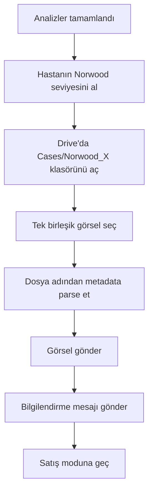

# Google Entegrasyonları Implementation Plan

## Genel Bakış

Bu plan, WhatsApp AI asistanı için Google Sheets, Drive ve Calendar entegrasyonlarını kapsar.

---

## Faz 1: Google Sheets - Hasta Takip Tablosu

### 1.1 Tablo Yapısı

> [!IMPORTANT]
> Tablo adı: **Cliniolabs Hasta Takip**

| Kolon | Alan | Açıklama | Güncelleyen Node |
|-------|------|----------|------------------|
| A | created_at | İlk iletişim tarihi | İlk kayıt |
| B | phone | Hasta telefonu | İlk kayıt |
| C | name | Hasta adı | Extract Patient Info |
| D | norwood | Dökülme seviyesi (1-7) | Extract Analysis |
| E | graft_min | Minimum greft | Extract Analysis |
| F | graft_max | Maximum greft | Extract Analysis |
| G | donor_quality | İYİ/ORTA/SINIRLI | Extract Analysis |
| H | technique | FUE/DHI | Extract Analysis |
| I | summary | AI hasta özeti | Build Chat Prompt |
| J | sentiment | Pozitif/Nötr/Negatif | Build Chat Prompt |
| K | purchase_rate | 1-10 arası satın alma ihtimali | Build Chat Prompt |
| L | doctor_note | Doktor için özel not | AI çıkarım |
| M | appointment_date | Randevu tarihi | Calendar entegrasyonu |
| N | status | YENİ/İLETİŞİMDE/RANDEVU/TAMAMLANDI | Workflow |
| O | last_contact | Son iletişim zamanı | Her mesajda |

### 1.2 Kolon Çakışması Çözümü

> [!WARNING]
> Önceki sorun: Farklı node'lar aynı satırı güncellerken birbirinin verisini siliyordu.

**Çözüm: "Read-Merge-Write" Yaklaşımı**

```javascript
// 1. Mevcut satırı oku
const existingRow = await readRow(phone);

// 2. Sadece dolu alanları merge et
const mergedRow = { ...existingRow };
for (const [key, value] of Object.entries(newData)) {
  if (value !== null && value !== undefined && value !== '') {
    mergedRow[key] = value;
  }
}

// 3. Tek seferde yaz
await updateRow(mergedRow);
```

### 1.3 Konuşma Aşamaları (Conversation Stages)

```
STARTED → QUESTIONS → WAITING_PHOTO → ANALYZED → OFFERED → BOOKED/REJECTED/PASSIVE
```

| Aşama | Tetikleyen | Açıklama |
|-------|-----------|----------|
| STARTED | İlk mesaj | Hasta konuşmayı başlattı |
| QUESTIONS | Sorular soruldu | Yeterlilik soruları |
| WAITING_PHOTO | "Foto gönder" istendi | Foto bekleniyor |
| ANALYZED | Analiz tamamlandı | Norwood + Donör tamam |
| OFFERED | Before/After gönderildi | Randevu teklif edildi |
| BOOKED | Randevu alındı | ✅ Tamamlandı |
| REJECTED | Olumsuz cevap | ❌ Reddetti |
| PASSIVE | 48 saat cevapsız | 💤 Pasif |

### 1.4 Sheets Güncelleme Zamanlaması

> [!IMPORTANT]
> Sürekli güncelleme yerine sadece **5 tetikleme noktası**

| # | Tetikleyici | Güncellenen Alanlar |
|---|-------------|---------------------|
| 1 | İlk mesaj | phone, created_at, stage=STARTED |
| 2 | Sorular tamamlandı | name, summary, stage=QUESTIONS |
| 3 | Analiz tamamlandı | norwood, graft, donor, rate, stage=ANALYZED |
| 4 | Before/After gönderildi | stage=OFFERED |
| 5 | Randevu/Red/48 saat | sentiment, appointment, stage=FINAL |

### 1.5 Hatırlatma Mantığı

| Süre | Durum | Aksiyon |
|------|-------|---------|
| 24 saat cevapsız | OFFERED | Hatırlatma mesajı gönder |
| 48 saat cevapsız | OFFERED | stage=PASSIVE, dur |

---

## Faz 2: Google Drive - Dosya Yönetimi

### 2.1 Klasör Yapısı

```
📁 Cliniolabs (Root)
│
├── 📁 Patients
│   └── 📁 905551234567
│       ├── 📸 905551234567_5_4500_FUE_front.jpg
│       ├── 📸 905551234567_5_4500_FUE_top.jpg
│       ├── 📸 905551234567_5_4500_FUE_side.jpg
│       └── 📸 905551234567_5_4500_FUE_back.jpg
│
└── 📁 Cases
    ├── 📁 Norwood_3
    │   └── 📸 3500_FUE_12ay.jpg  ← Tek birleşik görsel
    ├── 📁 Norwood_4
    │   └── 📸 4000_FUE_12ay.jpg
    ├── 📁 Norwood_5
    │   └── 📸 4500_FUE_12ay.jpg
    ├── 📁 Norwood_6
    │   └── 📸 5000_DHI_12ay.jpg
    └── 📁 Norwood_7
        └── 📸 5500_FUE_12ay.jpg
```

### 2.2 Dosya Adlandırma Kuralları

| Tür | Format | Örnek |
|-----|--------|-------|
| Hasta foto | `phone_norwood_greft_teknik_açı.jpg` | `905551234567_5_4500_FUE_front.jpg` |
| Case foto | `greft_teknik_süre.jpg` | `4500_FUE_12ay.jpg` |

> [!NOTE]
> Before/After tek birleşik görsel - ayrı before/after yok

### 2.3 Dosya Adından Metadata Parse

```javascript
// Case dosyası: 4500_FUE_12ay.jpg
const filename = "4500_FUE_12ay.jpg";
const [graft, technique, duration] = filename.replace('.jpg', '').split('_');
// graft = "4500", technique = "FUE", duration = "12ay"

const months = duration.replace('ay', '');
const message = `Bu hastamız sizinle aynı seviyedeydi. ${graft} greft ile ${technique} tekniği uygulandı. ${months} ay sonunda bu sonuca ulaştı.`;
```

### 2.4 Hasta Fotoğrafı Kaydetme

```javascript
async function savePatientPhoto(phone, norwood, graft, technique, angle, photoBuffer) {
  const patientsFolder = await findFolder('Patients');
  let patientFolder = await findFolder(phone, patientsFolder);
  if (!patientFolder) {
    patientFolder = await createFolder(phone, patientsFolder);
  }
  const filename = `${phone}_${norwood}_${graft}_${technique}_${angle}.jpg`;
  await uploadFile(patientFolder, photoBuffer, filename);
}
```

---

## Faz 3: Before/After Gönderimi

### 3.1 Tetikleme Noktası

```
Her iki analiz tamamlandı (Norwood + Donör)
    ↓
Tamamlama mesajları gönderildi
    ↓
Before/After akışı başlar
```

### 3.2 Akış



### 3.3 Gönderim Sırası

1. **Görsel gönder** (tek birleşik before/after)
2. **Bilgilendirme mesajı gönder:**

```
Bu hastamız sizinle aynı seviyedeydi.
${graft} greft ile ${technique} tekniği uygulandı.
${months} ay sonunda bu sonuca ulaştı.
```

3. **Satış moduna geç**

### 3.4 Satış Modu (Orta Seviye)

> [!IMPORTANT]
> Before/After gönderildikten sonra AI satış moduna geçer

**Kullanılacak ifadeler:**
- "Şu an için birkaç randevu açığımız var, hızlı davranmanızı öneririm"
- "Sizin gibi vakalarda erken müdahale çok önemli"
- "Doktorumuzla ne zaman görüşmek istersiniz? Yarın mı bu hafta mı?"

**KULLANILMAYACAK:**
- ❌ "Son şans!", "Kaçırmayın!"
- ❌ Fiyat baskısı
- ❌ Her mesajda aynı şeyi söyleme

---

## Faz 4: Google Calendar - Randevu

### 4.1 Ön Koşullar

- [ ] Google Calendar API credential'ı ekle
- [ ] OAuth consent screen ayarla
- [ ] n8n'de Calendar credential oluştur

### 4.2 Satış Modu Akışı

Before/After gönderildikten sonra AI asistan daha satışçı davranır:

```
AI: "Size benzer vakamızı gördünüz. Doktorumuzla görüşmek için ne zaman müsaitsiniz?"

Hasta: "Pazartesi öğleden sonra uygun"

AI: "Pazartesi saat 14:00'e randevu oluşturayım mı? Video görüşme mi yoksa kliniğe gelir misiniz?"

Hasta: "Video olsun"

AI: "Randevunuz oluşturuldu! 📅 Pazartesi 14:00'de Google Meet linki size iletilecek."
```

### 4.3 Calendar Event Yapısı

```javascript
{
  summary: "Saç Ekimi Konsültasyon - ${name}",
  description: `
    Hasta: ${name}
    Telefon: ${phone}
    Norwood: ${norwood}
    Greft: ${graft_min}-${graft_max}
    Donör: ${donor_quality}
  `,
  start: {
    dateTime: "2024-12-20T14:00:00",
    timeZone: "Europe/Istanbul"
  },
  end: {
    dateTime: "2024-12-20T14:30:00",
    timeZone: "Europe/Istanbul"
  },
  conferenceData: {
    createRequest: {
      requestId: phone + "_" + Date.now(),
      conferenceSolutionKey: { type: "hangoutsMeet" }
    }
  }
}
```

### 4.4 Randevu Süresi

> [!NOTE]
> **Öneri:** Standart 30 dakika. Video görüşme için yeterli.

---

## Uygulama Sırası

| # | Faz | Task | Bağımlılık | Tahmini Süre |
|---|-----|------|------------|--------------|
| 1 | Sheets | Tablo oluştur | - | 10 dk |
| 2 | Sheets | n8n Sheets node'u ekle | 1 | 30 dk |
| 3 | Sheets | Read-Merge-Write logic | 2 | 1 saat |
| 4 | Drive | Patients klasör yapısı | - | 10 dk |
| 5 | Drive | Foto kaydetme node'u | 4 | 1 saat |
| 6 | Drive | Cases klasör yapısı | - | 10 dk |
| 7 | Drive | Örnek vakalar ekle | 6 | Manual |
| 8 | B/A | Before/After gönderim akışı | 6, 7 | 2 saat |
| 9 | Calendar | Credential ekle | - | 15 dk |
| 10 | Calendar | Randevu alma akışı | 8, 9 | 2 saat |

---

## Karar Özeti

| Konu | Karar |
|------|-------|
| Sıkıştırma | WhatsApp otomatik yapıyor, gerek yok |
| Before/After | Tek birleşik görsel |
| Dosya adlandırma | Metadata dosya adında |
| Satış modu | Orta seviye |
| Vaka sayısı | 1 vaka |
| Randevu süresi | 30 dakika |

---

## Notlar

- Tüm entegrasyonlar mevcut workflow'a eklenecek
- Her faz bağımsız test edilebilir
- Sheets kolon çakışması öncelikli çözülmeli
- Cases klasörüne birleşik görseller manuel yüklenecek
